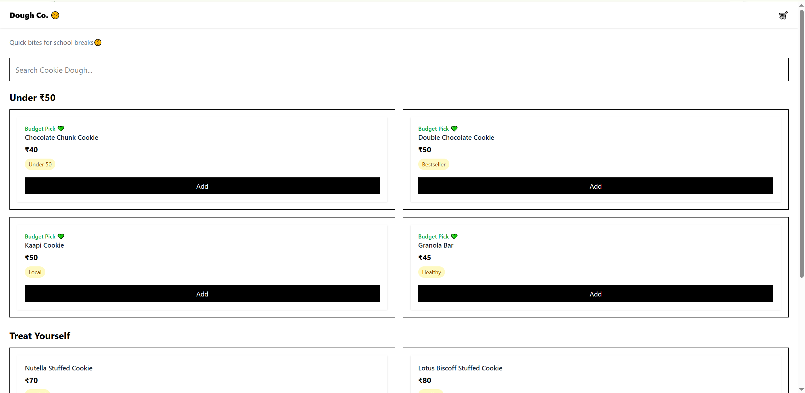
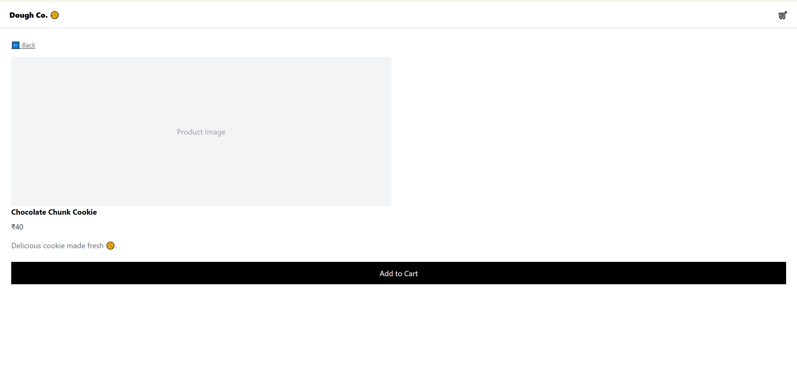
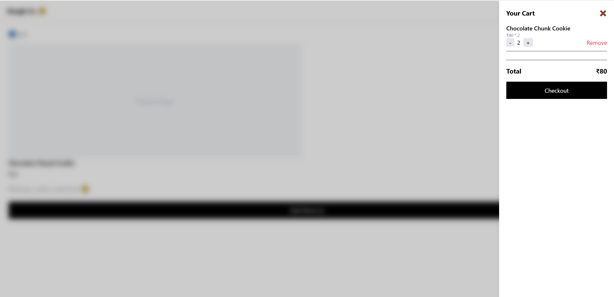

# DoughCo Frontend 🍪

A product-focused React application simulating an online cookie dough store, built to demonstrate modern frontend architecture, state management, and user-centric design.

---

## 🚀 Features

* 🛒 Add to Cart with quantity management
* 🌐 Global state management using Context API
* 💾 Cart persistence using localStorage
* 🔍 Real-time search & filtering
* ⚡ Async data loading simulation
* ❌ Error handling with retry mechanism
* 🎨 Smooth UI interactions & micro-animations

---

## 🧠 Tech & Concepts Used

* React (Functional Components, Hooks)
* Context API (Global State Management)
* Custom Hooks (`useCart`)
* React Router (Dynamic Routing)
* Tailwind CSS (Styling & UI)
* LocalStorage (State Persistence)

---

## 🏗️ Architecture

* `useCart` → Handles business logic (cart operations)
* `CartContext` → Distributes global state
* Components → UI rendering
* Pages → Route-based structure

---

## 🔄 App Flow

1. User browses products on Home page
2. Clicks a product → navigates to detail page
3. Adds items to cart
4. Cart updates globally via Context API
5. Data persists via localStorage

---

## ⚙️ Key Engineering Decisions

* Used Context API to avoid prop drilling and scale state management
* Extracted cart logic into a reusable custom hook
* Implemented loading, error, and retry states for realistic async behavior
* Focused on clean component architecture and separation of concerns

---

## 📸 Screenshots





---

## ▶️ Getting Started

```bash
npm install
npm run dev
```

---

## 🎯 Why this project

Built to transition into frontend/product engineering roles by demonstrating:

* Real-world state management
* UX-focused feature development
* Clean and scalable React architecture

---
